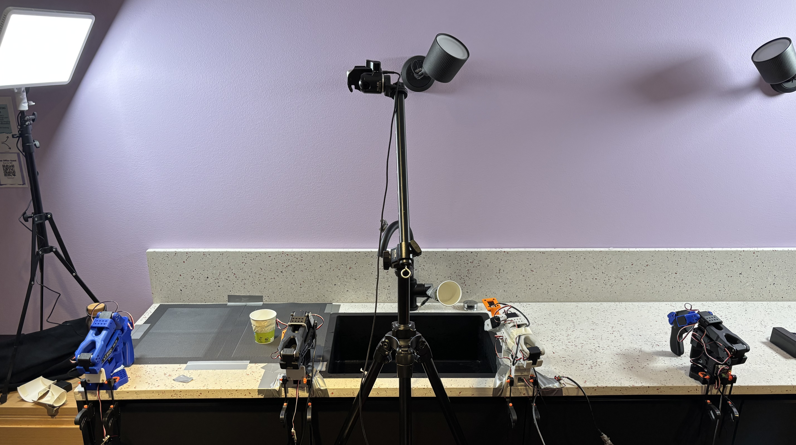
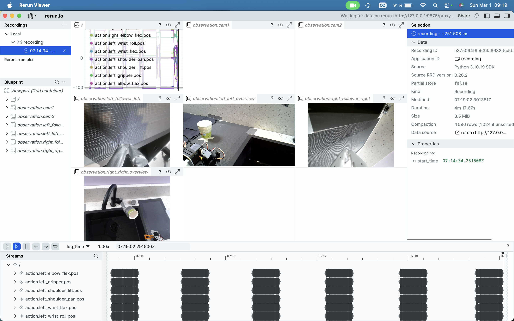

# Robotics Nation Hackathon 2026 — Collaborative Bimanual AI Robotics

> Repository for our project at the [Robotics Nation Hackathon 2026](https://luma.com/0dn6im3g?tk=ImilEB).

**Team:** [@Cl3mensM](https://github.com/Cl3mensM), [@Pranish-37](https://github.com/Pranish-37), [@pauliusrag](https://github.com/pauliusrag), [@kugelblytz](https://github.com/kugelblytz), [@florian-immig](https://github.com/florian-immig)

We built a collaborative setup with **two SO-101 leader arms** and **two SO-101 follower arms** to solve coordinated two-arm manipulation tasks.  
We secured **first place** at the hackathon out of 50+ participants 🚀

### 🛠️ Tech Stack
     

## Quick Summary

- Built and tested bimanual collaborative robot behaviors for daily-assistance scenarios.
- Collected **10+ datasets** (including exploratory and non-useful runs).
- Trained **70+ models** during iterative experimentation.
- Used **ACT** for policy training on **Google Cloud**.
- Deployed and ran policy inference via async inference server on Verda.

## Demo Videos

### Task 1 — Fill Cup Together
One arm brings the cup to the tap while the other arm turns the tap on to fill it.

<iframe width="560" height="315" src="https://www.youtube.com/embed/NVHb-mLm7kE" title="Task 1 Demo" frameborder="0" allow="accelerometer; autoplay; clipboard-write; encrypted-media; gyroscope; picture-in-picture; web-share" allowfullscreen></iframe>

Direct link: https://youtu.be/NVHb-mLm7kE

### Task 2 — Place Object into Cup Together
One arm brings the cup while the other arm drops an item in (e.g. vitamins).

<iframe width="560" height="315" src="https://www.youtube.com/embed/xINkiETv5cA" title="Task 2 Demo" frameborder="0" allow="accelerometer; autoplay; clipboard-write; encrypted-media; gyroscope; picture-in-picture; web-share" allowfullscreen></iframe>

Direct link: https://youtu.be/xINkiETv5cA

## Dataset & Models

- Hugging Face collection: https://huggingface.co/collections/cl3mens/roboticsnationhackathon2026
- Previous idea: train models separately per task and combine later.

## System Setup

### Robot Configuration

- 2x SO-101 leader arms
- 2x SO-101 follower arms
- 4 cameras total:
	- 1 camera on each follower arm
	- 2 top overview cameras (left + right)

### Complete Setup



## Training

We used **ACT** for training on **Google Cloud**.

### Rerun.io Environment View

We used Rerun.io to inspect and monitor robot/environment data during collection and debugging.



- TODO: Add exact training hyperparameters (steps, batch size, LR, augmentations, seeds).
- TODO: Add final model selection criteria and evaluation notes.

## Inference Commands (Verda Server)

### Policy: put-in-cup model

```bash
python -m lerobot.async_inference.robot_client \
	--server_address=95.133.253.67:8080 \
	--robot.type=bi_so_follower \
	--robot.id=my_bi_so101_follower \
	--robot.left_arm_config.port=/dev/tty.usbmodem5AAF2628661 \
	--robot.right_arm_config.port=/dev/tty.usbmodem5AAF2632181 \
	--robot.left_arm_config.cameras='{"follower_left":{"type":"opencv","index_or_path":2,"width":640,"height":480,"fps":30,"fourcc":"MJPG"},"left_overview":{"type":"opencv","index_or_path":3,"width":1280,"height":720,"fps":15,"fourcc":"MJPG"}}' \
	--robot.right_arm_config.cameras='{"follower_right":{"type":"opencv","index_or_path":0,"width":640,"height":480,"fps":30,"fourcc":"MJPG"},"right_overview":{"type":"opencv","index_or_path":1,"width":640,"height":480,"fps":15,"fourcc":"MJPG"}}' \
	--task="Fill cup together" \
	--policy_type=act \
	--pretrained_name_or_path=kugelblytz/so101_put_in_cup_longer_act_100000steps_bs4_32000_latest \
	--policy_device=cuda \
	--actions_per_chunk=100 \
	--chunk_size_threshold=0.2 \
	--aggregate_fn_name=latest_only \
	--debug_visualize_queue_size=True
```

### Policy: fill-cup-together model

```bash
python -m lerobot.async_inference.robot_client \
	--server_address=95.133.253.67:8080 \
	--robot.type=bi_so_follower \
	--robot.id=my_bi_so101_follower \
	--robot.left_arm_config.port=/dev/tty.usbmodem5AAF2628661 \
	--robot.right_arm_config.port=/dev/tty.usbmodem5AAF2632181 \
	--robot.left_arm_config.cameras='{"follower_left":{"type":"opencv","index_or_path":2,"width":640,"height":480,"fps":30,"fourcc":"MJPG"},"left_overview":{"type":"opencv","index_or_path":3,"width":1280,"height":720,"fps":15,"fourcc":"MJPG"}}' \
	--robot.right_arm_config.cameras='{"follower_right":{"type":"opencv","index_or_path":0,"width":640,"height":480,"fps":30,"fourcc":"MJPG"},"right_overview":{"type":"opencv","index_or_path":1,"width":640,"height":480,"fps":15,"fourcc":"MJPG"}}' \
	--task="Fill cup together" \
	--policy_type=act \
	--pretrained_name_or_path=kugelblytz/so101_fill_cup_together_act_30000steps_bs4_58000_latest \
	--policy_device=cuda \
	--actions_per_chunk=100 \
	--chunk_size_threshold=0.2 \
	--aggregate_fn_name=latest_only \
	--debug_visualize_queue_size=True
```

## Use Cases

- Elderly care assistance (preparing medication/vitamins, routine support).
- Daily support routines (e.g. preparing water and hydration reminders).
- Collaborative household assistance where two coordinated manipulators are useful.

## Challenges

- Setup and calibration of robot arms and motors.
- Serial port / device mapping issues.
- Rapid iteration under hackathon time constraints.
- TODO: Add more key technical challenges and fixes.

## Reflection

This was a great learning experience for the whole team across robotics hardware, data collection, policy training, and deployment.

---

If you have suggestions or want to collaborate, feel free to open an issue or contact the team members above.
